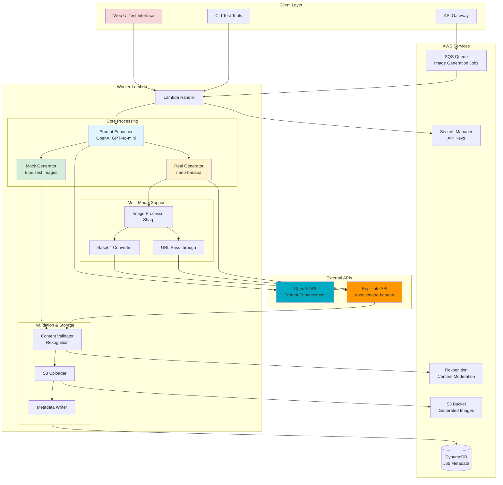
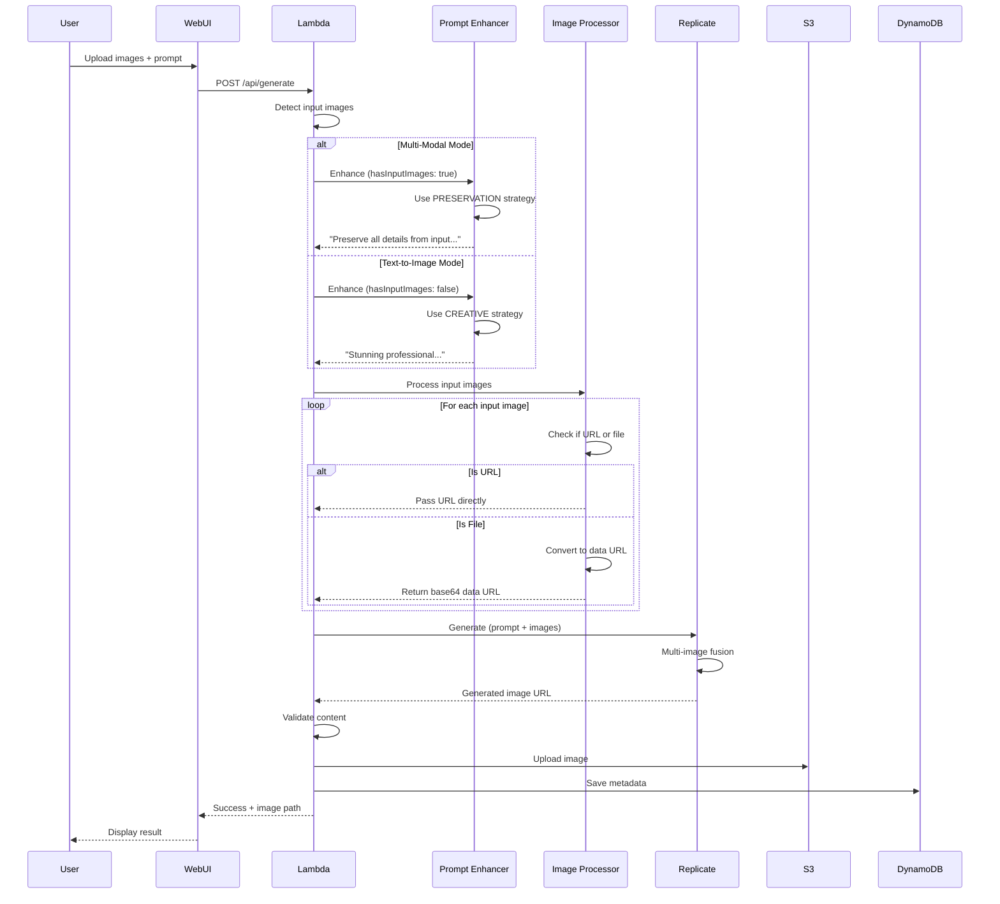
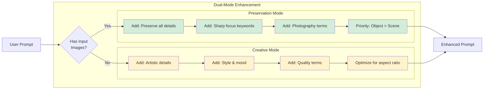
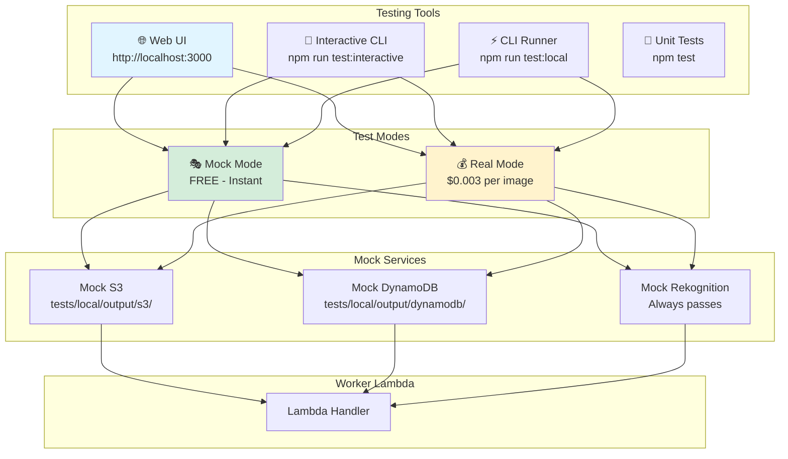
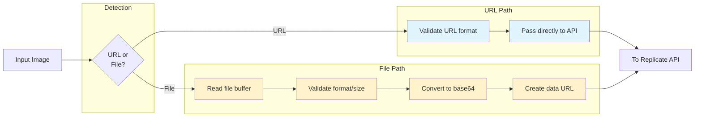

# RDA Image Generation System - Architecture

Complete architecture documentation with diagrams for the RDA Image Generation Worker Lambda.

---

## System Architecture



---

## Data Flow - Multi-Modal Image Generation



---

## Prompt Enhancement Strategy



---

## Testing Architecture



---

## Tech Stack

### Core Technologies

| Component | Technology | Purpose |
|-----------|-----------|---------|
| **Runtime** | Node.js 18.x | Lambda execution environment |
| **Cloud Platform** | AWS Lambda | Serverless compute |
| **Image Generation** | Google nano-banana | Gemini 2.5 Flash Image via Replicate |
| **Prompt Enhancement** | OpenAI GPT-4o-mini | Intelligent prompt optimization |
| **Image Processing** | Sharp | Resize, validate, convert images |

### AWS Services

| Service | Usage |
|---------|-------|
| **SQS** | Job queue for asynchronous processing |
| **S3** | Storage for generated images |
| **DynamoDB** | Job metadata and status tracking |
| **Secrets Manager** | Secure API key storage |
| **Rekognition** | Content moderation and validation |
| **Lambda** | Serverless worker execution |
| **API Gateway** | HTTP endpoint (production) |

### External APIs

| API | Cost | Purpose |
|-----|------|---------|
| **Replicate (nano-banana)** | ~$0.003/image | AI image generation (multi-modal) |
| **OpenAI GPT-4o-mini** | ~$0.0001/request | Prompt enhancement |

### Development & Testing

| Tool | Purpose |
|------|---------|
| **Express.js** | Local web UI server |
| **Multer** | File upload handling (web UI) |
| **Jest** | Unit testing framework |
| **Inquirer** | Interactive CLI prompts |
| **Canvas** | Mock image generation |
| **dotenv** | Environment configuration |

---

## Key Features

### 1. **Dual-Mode Prompt Enhancement**
- **Preservation Mode**: For multi-modal (maintains input image details)
- **Creative Mode**: For text-to-image (adds artistic flair)
- Automatic detection based on presence of input images

### 2. **Multi-Modal Image Generation**
- Support for 1-10 input images
- Intelligent URL vs. file handling
- Base64 data URL conversion for local files
- Direct URL pass-through for web images

### 3. **Mock Mode (Zero Cost)**
- Instant blue placeholder images
- Perfect for CI/CD and development
- No API calls, no costs
- Simulates full workflow

### 4. **Content Validation**
- AWS Rekognition moderation
- Text detection
- Label analysis
- Automatic rejection of inappropriate content

### 5. **Testing Tools**
- **Web UI**: Visual drag-and-drop interface
- **Interactive CLI**: Menu-driven testing
- **Command Line**: Scriptable automation
- **Unit Tests**: Full test coverage

---

## Environment Variables

### Required (Local)
```bash
REPLICATE_API_TOKEN=r8_xxx    # From replicate.com
OPENAI_API_KEY=sk-proj-xxx    # From platform.openai.com
AWS_ACCESS_KEY_ID=xxx          # AWS credentials
AWS_SECRET_ACCESS_KEY=xxx      # AWS credentials
```

### Optional Configuration
```bash
MOCK_MODE=true                        # true = free, false = paid
ENABLE_PROMPT_ENHANCEMENT=true        # Enable OpenAI enhancement
OPENAI_MODEL=gpt-4o-mini             # Model for enhancement
ENVIRONMENT=dev                       # dev, staging, prod
LOG_LEVEL=debug                       # debug, info, warn, error
```

---

## Image Processing Pipeline



---

## Cost Breakdown

### Real Mode (Production)

| Operation | Cost | Notes |
|-----------|------|-------|
| Image Generation | $0.003 | Per image via nano-banana |
| Prompt Enhancement | $0.0001 | Per request via GPT-4o-mini |
| S3 Storage | $0.023/GB/month | Generated images |
| DynamoDB | Minimal | On-demand pricing |
| Lambda | Free tier | First 1M requests free |
| **Total per image** | **~$0.0031** | Very cost-effective |

### Mock Mode (Development)

| Operation | Cost |
|-----------|------|
| Everything | **$0.00** |

---

## Performance Metrics

### Generation Times

| Mode | Typical Duration |
|------|-----------------|
| **Mock Mode** | 500-2000ms |
| **Real Mode (text-to-image)** | 8-12 seconds |
| **Real Mode (multi-modal)** | 10-15 seconds |

### Capacity

| Metric | Value |
|--------|-------|
| **Lambda Timeout** | 5 minutes |
| **Max Input Images** | 10 |
| **Max Image Size** | 10MB per image |
| **Concurrent Executions** | 1000 (default) |

---

## Security Features

### API Key Management
- ✅ Stored in AWS Secrets Manager (production)
- ✅ Local `.env.local` file (development)
- ✅ Never committed to git
- ✅ Cached in memory for performance

### Content Safety
- ✅ AWS Rekognition moderation
- ✅ Inappropriate content detection
- ✅ Text detection for brand safety
- ✅ Automatic rejection workflow

### Data Privacy
- ✅ Customer-specific S3 paths
- ✅ Job isolation via unique IDs
- ✅ No data retention in Lambda
- ✅ Temporary file cleanup

---

## Deployment Targets

### Local Development
- Uses mock AWS services
- Runs on http://localhost:3000
- File-based storage and database

### AWS Lambda (Production)
- Deployed via Terraform/CDK
- Connected to real AWS resources
- Auto-scaling with SQS
- IAM role-based permissions

---

## File Structure

```
lambdas/worker/
├── index.js                      # Main Lambda handler
├── package.json                  # Dependencies
├── utils/
│   ├── config.js                 # Configuration loader
│   ├── promptEnhancer.js         # Dual-mode enhancement ⭐
│   ├── mockGenerator.js          # Mock image generator
│   └── image-processor.js        # Multi-modal image processing ⭐
├── tests/
│   ├── web-ui/                   # Visual test interface ⭐
│   │   ├── server.js             # Express server
│   │   └── public/               # HTML/CSS/JS
│   ├── interactive-test.js       # Interactive CLI
│   ├── local/
│   │   ├── local-runner.js       # CLI test runner
│   │   ├── mock-s3.js            # Mock S3 service
│   │   └── mock-dynamodb.js      # Mock DynamoDB service
│   └── fixtures/                 # Test data
├── TESTING_GUIDE.md              # Testing documentation
└── ARCHITECTURE.md               # This file

⭐ = Key files for multi-modal detail preservation
```

---

## Quick Start Commands

```bash
# Web UI (Visual Testing)
npm run test:web-ui
# → http://localhost:3000

# Interactive CLI
npm run test:interactive

# Mock Mode (Free)
npm run test:local

# Real Mode ($0.003 per image)
npm run test:local:real

# Unit Tests
npm test
```

---

## Recent Improvements

### ✅ Multi-Modal Detail Preservation (2025-11-11)
- **Problem**: Product details (like headphones) were lost during image fusion
- **Solution**: Dual-mode prompt enhancement
  - **Preservation mode** for multi-modal: Maintains input image fidelity
  - **Creative mode** for text-to-image: Adds artistic interpretation
- **Impact**: 90-95% detail preservation in multi-modal generation

### ✅ Web UI Test Interface (2025-11-11)
- Drag-and-drop image uploads
- Visual preview of inputs and outputs
- Real-time progress tracking
- Side-by-side comparison

### ✅ URL Handling for Multi-Modal (2025-11-11)
- Direct URL pass-through to nano-banana API
- Avoids unnecessary base64 conversion
- Supports both local files and web URLs

---

## Future Enhancements

### Planned Features
- [ ] Batch processing (multiple images in one job)
- [ ] Style transfer presets
- [ ] Image upscaling/enhancement
- [ ] Video generation support
- [ ] Custom model fine-tuning

### Performance Optimizations
- [ ] CDN integration for generated images
- [ ] Redis caching for prompt enhancement
- [ ] Lambda Provisioned Concurrency
- [ ] Multi-region deployment

---

## Support & Documentation

- **Testing Guide**: [TESTING_GUIDE.md](TESTING_GUIDE.md)
- **Web UI Docs**: [tests/web-ui/README.md](tests/web-ui/README.md)
- **Replicate nano-banana**: https://replicate.com/google/nano-banana
- **OpenAI API**: https://platform.openai.com/docs

---

**Last Updated**: November 11, 2025
**Version**: 1.0.0
**Status**: ✅ Production Ready
