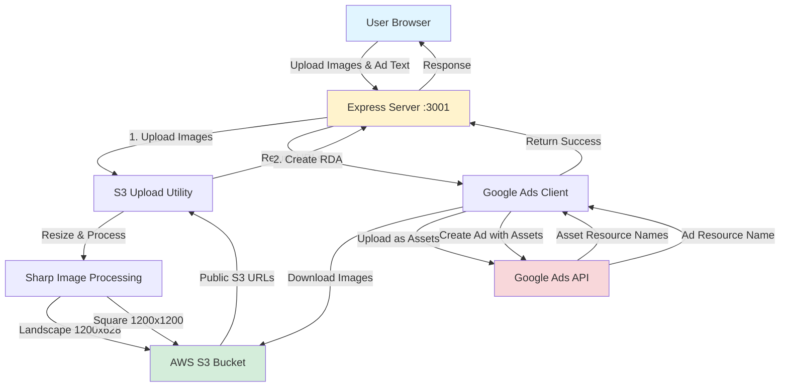

# RDA Publisher - Architecture

## System Architecture Diagram



## Data Flow

### Full Flow (Recommended)

**POST /api/publish-ad-full-flow**

```
┌─────────────────────────────────────────────────────────────┐
│ Step 1: Image Upload to S3                                 │
├─────────────────────────────────────────────────────────────┤
│                                                             │
│  User Images                                                │
│      ↓                                                      │
│  Sharp Processing                                           │
│      ├─→ Landscape (1200x628) → S3                         │
│      └─→ Square (1200x1200) → S3                           │
│                                                             │
│  Result: S3 URLs                                            │
│      - https://bucket.s3.../landscape-1.jpg                 │
│      - https://bucket.s3.../square-1.jpg                    │
│                                                             │
└─────────────────────────────────────────────────────────────┘
                          ↓
┌─────────────────────────────────────────────────────────────┐
│ Step 2: Upload Images as Google Ads Assets                 │
├─────────────────────────────────────────────────────────────┤
│                                                             │
│  For each S3 URL:                                           │
│    1. Download image data from S3                           │
│    2. Convert to base64                                     │
│    3. Create Asset in Google Ads                            │
│    4. Get Asset Resource Name                               │
│                                                             │
│  Result: Asset Resource Names                               │
│      - customers/123/assets/456 (landscape)                 │
│      - customers/123/assets/789 (square)                    │
│                                                             │
└─────────────────────────────────────────────────────────────┘
                          ↓
┌─────────────────────────────────────────────────────────────┐
│ Step 3: Create Responsive Display Ad                       │
├─────────────────────────────────────────────────────────────┤
│                                                             │
│  Build Ad Object:                                           │
│    - marketing_images: [asset resource names]              │
│    - square_marketing_images: [asset resource names]       │
│    - headlines: ["Headline 1", "Headline 2", ...]          │
│    - long_headline: "Your Long Headline"                   │
│    - descriptions: ["Description 1", ...]                  │
│    - business_name: "Your Company"                         │
│    - final_urls: ["https://www.example.com"]               │
│                                                             │
│  Create AdGroupAd:                                          │
│    - ad_group: "customers/123/adGroups/456"                │
│    - ad: [Ad object from above]                            │
│    - status: PAUSED (for review)                           │
│                                                             │
│  Result: Created Ad                                         │
│      - customers/123/adGroupAds/789~101                    │
│                                                             │
└─────────────────────────────────────────────────────────────┘
```

### Separate Flows (Optional)

**POST /api/upload-images** → **POST /api/publish-ad**

Useful when you want to:
- Preview uploaded images before creating ads
- Reuse images for multiple ads
- Separate upload/publish steps in your workflow

## Components

### 1. Frontend (public/index.html)

**Responsibilities:**
- Image upload UI (drag & drop)
- Form validation
- Ad text input with character counters
- Display results

**Key Features:**
- Real-time character counting
- Image preview before upload
- Responsive design
- Error handling

### 2. Express Server (server.js)

**Responsibilities:**
- HTTP server
- API endpoint routing
- Request validation
- Error handling

**Endpoints:**
- `GET /api/health` - Health check
- `GET /api/customers` - List accessible customers
- `POST /api/upload-images` - Upload images to S3
- `POST /api/publish-ad` - Create RDA
- `POST /api/publish-ad-full-flow` - Combined flow

### 3. S3 Upload Utility (lib/s3Upload.js)

**Responsibilities:**
- Image processing with Sharp
- S3 upload management
- URL generation

**Functions:**
- `uploadToS3()` - Upload buffer to S3
- `processAndUploadImage()` - Resize and upload
- `uploadImagesForRDA()` - Batch upload with landscape/square versions

**Image Processing:**
```javascript
// Landscape (1.91:1 ratio)
1200 x 628 pixels
JPEG, 90% quality

// Square (1:1 ratio)
1200 x 1200 pixels
JPEG, 90% quality
```

### 4. Google Ads Client (lib/googleAdsClient.js)

**Responsibilities:**
- Google Ads API authentication
- Asset upload
- RDA creation

**Functions:**
- `getGoogleAdsClient()` - Initialize API client
- `uploadImageAsset()` - Upload single image as asset
- `createResponsiveDisplayAd()` - Create complete RDA
- `listAccessibleCustomers()` - Debug utility

**API Flow:**
```javascript
1. Initialize client with OAuth credentials
2. Create customer instance
3. For each image:
   - Download from S3
   - Convert to base64
   - Upload as Asset
4. Build ResponsiveDisplayAdInfo
5. Create AdGroupAd
6. Return resource name
```

## Error Handling

### Client-Side

```javascript
// Form validation
- Check image count (1-10)
- Validate text lengths
- Ensure required fields filled

// Display errors
- Alert banners
- Inline validation
- Character counters
```

### Server-Side

```javascript
// Request validation
- Check file types (images only)
- Validate file sizes (max 10MB)
- Check required fields

// Error responses
try {
  // Operation
} catch (error) {
  res.status(500).json({
    success: false,
    error: error.message,
    details: error.errors // Google Ads errors
  });
}
```

### Google Ads API

```javascript
// Common errors handled:
- Invalid credentials → 401
- Missing required fields → 400
- Asset upload failed → 500
- Ad creation failed → 500
- Invalid customer ID → 404
- Ad group not found → 404
```

## Security Considerations

### Environment Variables

- Never commit `.env.local` to git
- Use `.gitignore` to exclude sensitive files
- Rotate credentials regularly

### S3 Bucket

- Public read access for ad images
- Private upload access
- Consider signed URLs for production

### API Keys

- Store Google Ads credentials securely
- Use OAuth refresh tokens (not permanent)
- Enable API rate limiting

### Input Validation

- Validate image types and sizes
- Sanitize user input
- Check text lengths
- Prevent injection attacks

## Performance Optimization

### Image Processing

```javascript
// Parallel processing
await Promise.all(images.map(processImage));

// Efficient resizing
sharp(buffer)
  .resize(1200, 628, { fit: 'cover' })
  .jpeg({ quality: 90 })
  .toBuffer();
```

### API Calls

```javascript
// Batch asset uploads
await Promise.all(urls.map(uploadAsset));

// Single ad creation
await customer.adGroupAds.create([adGroupAd]);
```

### Caching

```javascript
// Reuse Google Ads client
const client = getGoogleAdsClient(); // Cached

// Store uploaded image URLs
// Avoid re-uploading same images
```

## Monitoring & Logging

### Server Logs

```javascript
console.log('📤 Uploading 2 images to S3...');
console.log('✅ Uploaded successfully: https://...');
console.log('🚀 Publishing RDA to Google Ads...');
console.log('✅ Ad created: customers/123/adGroupAds/456');
console.error('❌ Failed:', error);
```

### Health Checks

```bash
curl http://localhost:3001/api/health

{
  "status": "ok",
  "timestamp": "2024-01-15T10:00:00.000Z",
  "config": { ... }
}
```

### Error Tracking

- Log all errors with context
- Track API failures
- Monitor upload success rates
- Alert on critical errors

## Scaling Considerations

### Current Setup (Localhost)

- Single server instance
- Synchronous processing
- No load balancing
- Dev/test only

### Production Recommendations

1. **Serverless Architecture**
   - AWS Lambda for API endpoints
   - S3 for static hosting
   - CloudFront for CDN

2. **Queue-Based Processing**
   - SQS for async image processing
   - Separate workers for Google Ads API
   - Dead letter queues for failures

3. **Database**
   - DynamoDB for ad metadata
   - Track upload status
   - Store ad performance data

4. **Monitoring**
   - CloudWatch for metrics
   - Error tracking (Sentry)
   - Performance monitoring (New Relic)

5. **Rate Limiting**
   - Implement API rate limits
   - Google Ads API quota management
   - S3 upload throttling

## Testing Strategy

### Unit Tests

```javascript
// Test S3 upload
test('uploadToS3 returns URL', async () => {
  const url = await uploadToS3(buffer, 'test.jpg', 'image/jpeg');
  expect(url).toMatch(/https:\/\/.+\.s3\.amazonaws\.com/);
});

// Test image processing
test('processAndUploadImage creates correct dimensions', async () => {
  const result = await processAndUploadImage(buffer, 'test.jpg', 'landscape');
  expect(result.dimensions).toEqual({ width: 1200, height: 628 });
});
```

### Integration Tests

```javascript
// Test full flow
test('POST /api/publish-ad-full-flow creates ad', async () => {
  const formData = new FormData();
  formData.append('images', imageFile);
  formData.append('adData', JSON.stringify(adData));

  const response = await fetch('/api/publish-ad-full-flow', {
    method: 'POST',
    body: formData
  });

  const result = await response.json();
  expect(result.success).toBe(true);
  expect(result.resourceName).toMatch(/customers\/\d+\/adGroupAds\/\d+/);
});
```

### Manual Testing

1. Upload various image formats (JPG, PNG, WebP)
2. Test different image sizes
3. Validate text length limits
4. Test error scenarios
5. Verify ads in Google Ads UI

## Deployment

### Development (Current)

```bash
cd localhost-dev
npm start
# Server runs on http://localhost:3001
```

### Production Options

#### Option 1: AWS Elastic Beanstalk
```bash
eb init
eb create rda-publisher-prod
eb deploy
```

#### Option 2: Docker
```dockerfile
FROM node:20
WORKDIR /app
COPY package*.json ./
RUN npm install --production
COPY . .
CMD ["npm", "start"]
```

#### Option 3: Serverless (Recommended)
- Use AWS SAM or Serverless Framework
- Convert Express routes to Lambda functions
- Use API Gateway for routing
- Store in DynamoDB instead of memory

## Future Enhancements

1. **Batch Ad Creation** - Upload multiple ads at once
2. **Ad Templates** - Save and reuse ad configurations
3. **Preview Mode** - Preview ads before publishing
4. **Performance Tracking** - Monitor ad performance metrics
5. **A/B Testing** - Create ad variations automatically
6. **Approval Workflow** - Review ads before activation
7. **Webhook Integration** - Listen for ad status updates
8. **Cost Tracking** - Track ad spend and ROI
9. **Asset Library** - Reuse uploaded images
10. **Campaign Management** - Create and manage campaigns

## Resources

- [Google Ads API Documentation](https://developers.google.com/google-ads/api/docs)
- [Responsive Display Ads Guide](https://developers.google.com/google-ads/api/docs/responsive-display-ads)
- [google-ads-api npm package](https://www.npmjs.com/package/google-ads-api)
- [AWS SDK for JavaScript](https://docs.aws.amazon.com/AWSJavaScriptSDK/latest/)
- [Sharp Image Processing](https://sharp.pixelplumbing.com/)
